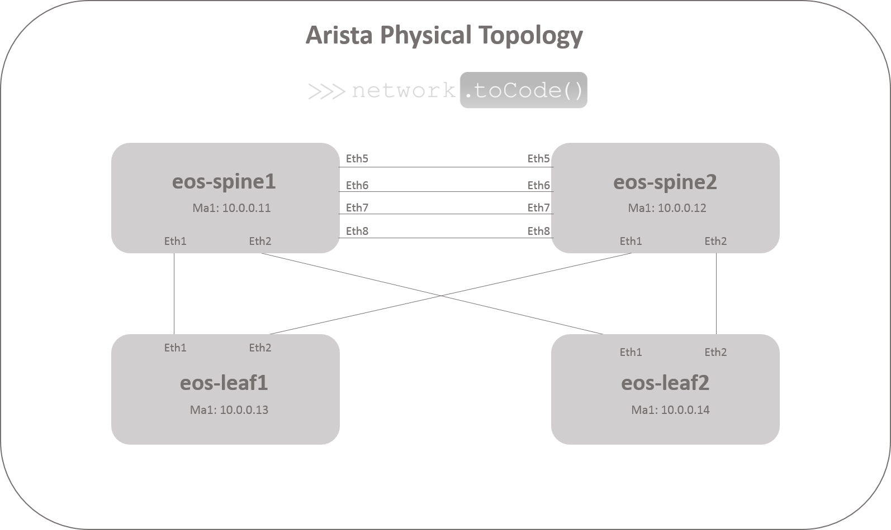
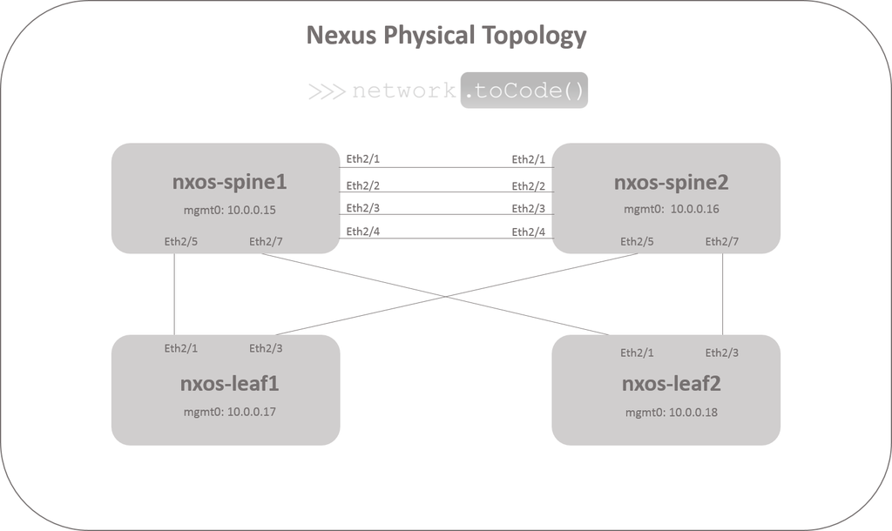
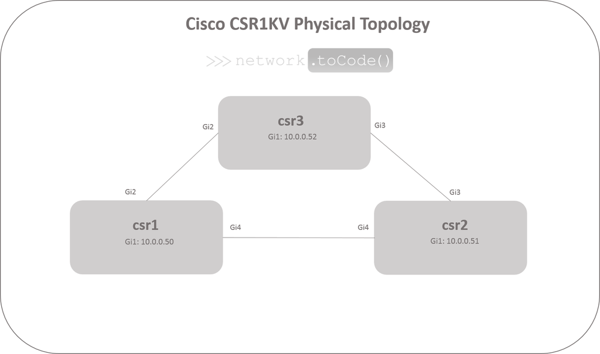

# Device Summary

| Hostname | Device | Management IP | Credentials | Access Method |
|----------|--------|---------------|-------------|---------------|
| ntc | Jump Host | 10.0.0.5 | ntc/ntc123 | RDP |
| eos-spine1 | Arista Spine | 10.0.0.11 | ntc/ntc123 | SSH/https/http |
| eos-spine2 | Arista Spine | 10.0.0.12 | ntc/ntc123 | SSH/https/http |
| eos-leaf1 | Arista Leaf | 10.0.0.13 | ntc/ntc123 | SSH/https/http |
| eos-leaf2 | Arista Leaf | 10.0.0.14 | ntc/ntc123 | SSH/https/http |
| nxos-spine1 | Cisco Spine | 10.0.0.15 | ntc/ntc123 | SSH/http |
| nxos-spine2 | Cisco Spine | 10.0.0.16 | ntc/ntc123 | SSH/http |
| nxos-leaf1 | Cisco Leaf | 10.0.0.17 | ntc/ntc123 | SSH/http |
| nxos-leaf2 | Cisco Leaf | 10.0.0.18 | ntc/ntc123 | SSH/http |
| csr1 | Cisco CSR1KV | 10.0.0.50 | ntc/ntc123 | SSH |
| csr2 | Cisco CSR1KV | 10.0.0.51 | ntc/ntc123 | SSH |
| csr3 | Cisco CSR1KV | 10.0.0.52 | ntc/ntc123 | SSH |
| tower | Ansible Tower | 10.0.0.7 | admin/ntc123 | https (Tower UI) |

### All hostnames are resolvable from the jump host.

### The Public IP address of the Jump Host will be provided to you.  This is how you will connect to everything else.

# Arista Network Design 

# Cisco Nexus Network Design

# Cisco CSR 1KV Network Design

