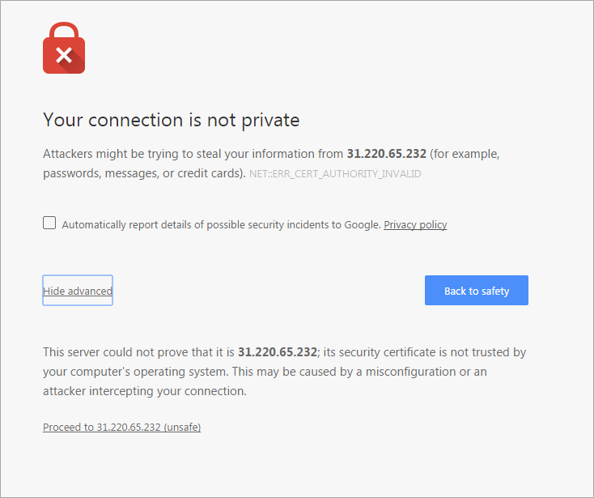
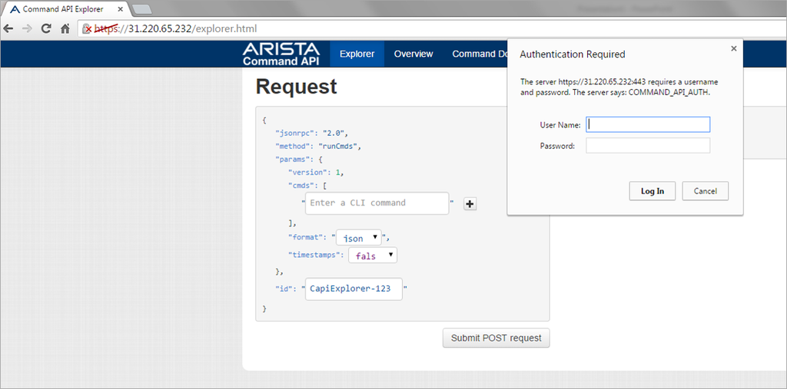
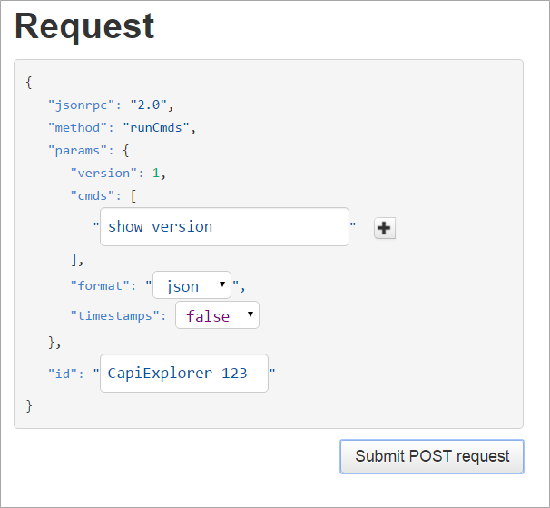
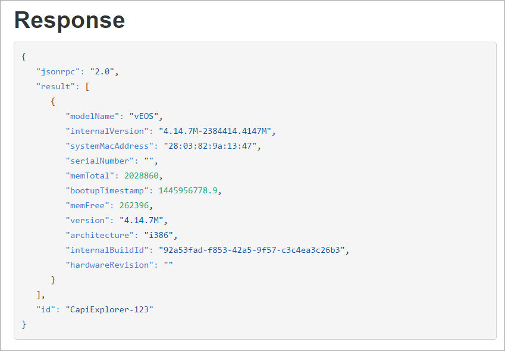
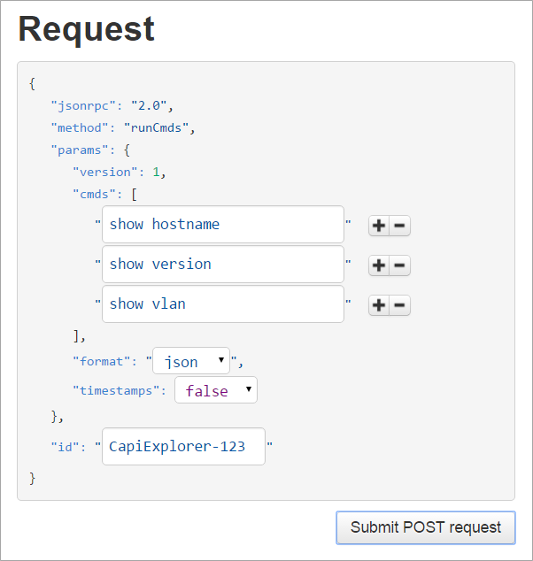
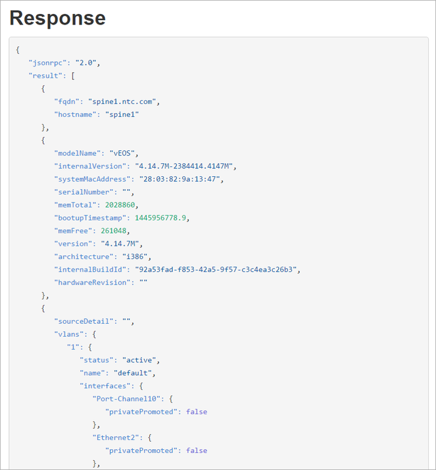
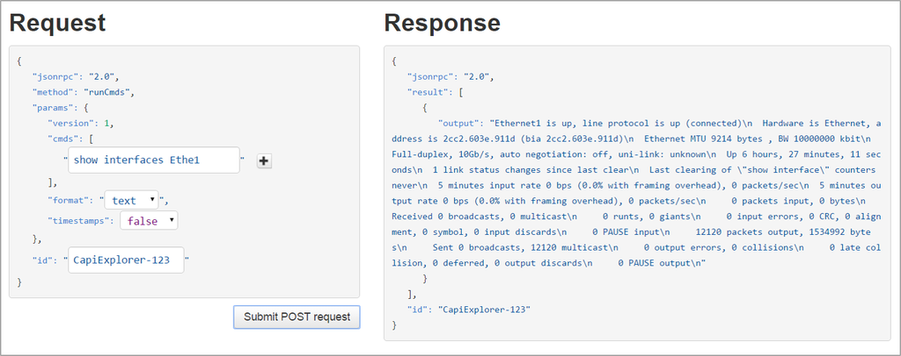
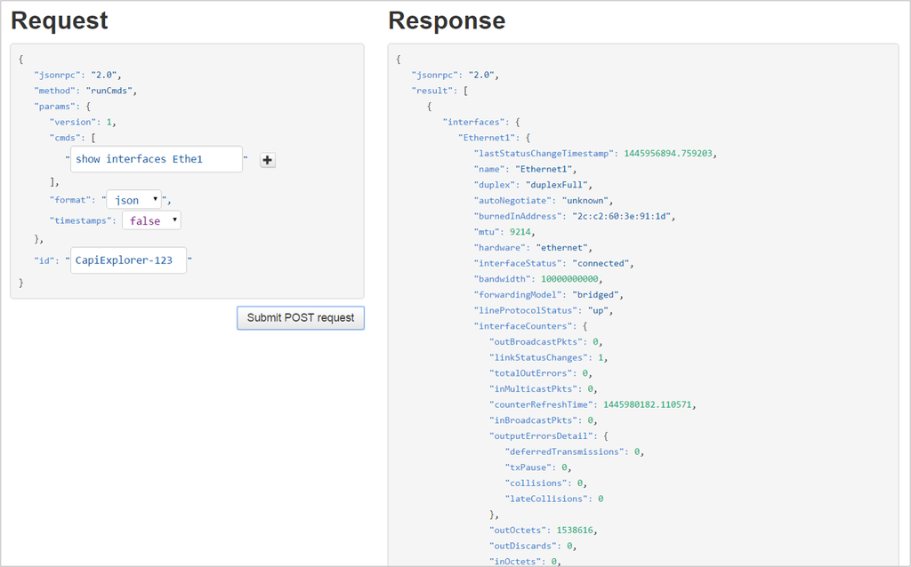
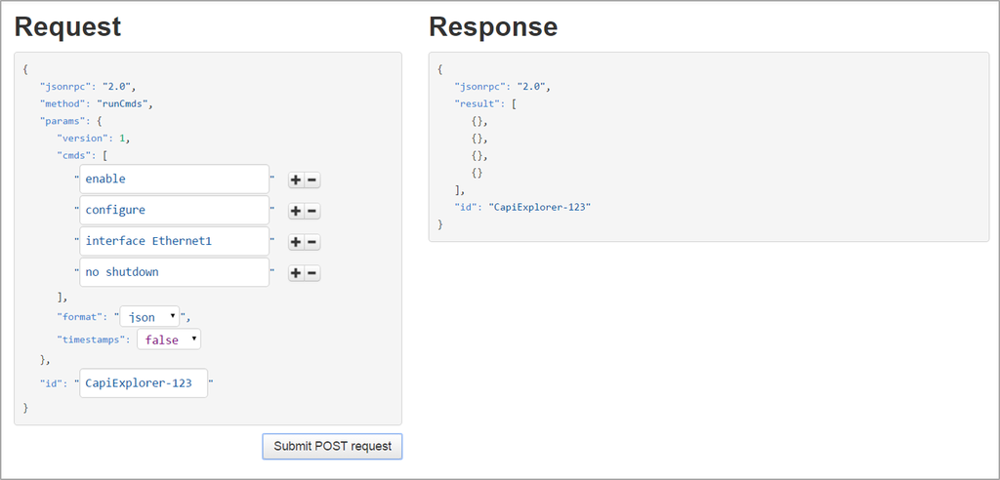

## Lab 16.1 - Arista eAPI

### Task 1 - Command Explorer

This tasks introduces you to the Command Explorer environment that exists on each Arista switch.  The command explorer is a great tool for beginners and experts alike, as it gives you direct insight with how the switch will respond to API calls.  This allows you to verify what key-value pairs and response you should be getting back as you are writing and testing your code.

##### Step 1

Open a Web Browser and connect to the switch. 

- Enter https://eos-spine1 into the browser.
 

##### Step 2

Click on the **Advanced** Link.

You will see the window expand.  Now click the **Proceed to eos-spine1 (unsafe)** link.

##### Step 3

Login with the credentials ntc/ntc123

##### Step 4

In the **Request** (left) pane, enter the command "show version" for the `cmds` key.  Take note that `cmds` is a list.  You can see this based on the brackets being used.

Click **Submit POST Request**

The response is displayed in the **Response** (right) pane:

Notice that the response is a JSON object (notice the curly braces) and this maps into a Python dictionary with three key-value pairs:  `jsonrpc`, `result`, and `id`.

##### Step 5

Since we saw `cmds` is a list, now send three commands:  "show hostname", "show version", and "show vlan".

##### Step 6

Click **Submit POST Request**

Notice the response.  `result` is now a list of three.  The response for each command is its own dictionary.

The previous examples all received JSON data back.  Now see what comes back when you switch `format` to "text" in the Request.

##### Step 7

Enter the command "show interfaces Eth1" and submit the POST request.

Notice the blob of text?

##### Step 8

Enter the same request, but now switch the `format` back to "JSON".

You can clearly see the value going between JSON and text.

##### Step 9

In the last step, try sending a configuration change using the Command Explorer.  Your goal is to perform a "no shutdown" on Ethernet1.

Enter the four commands: enable, configure, interface Ethernet1, and no shutdown.

##### Step 10

Try sending the request without one of these commands.

Take a few more minutes and continue to explore the Arista Command Explorer.

