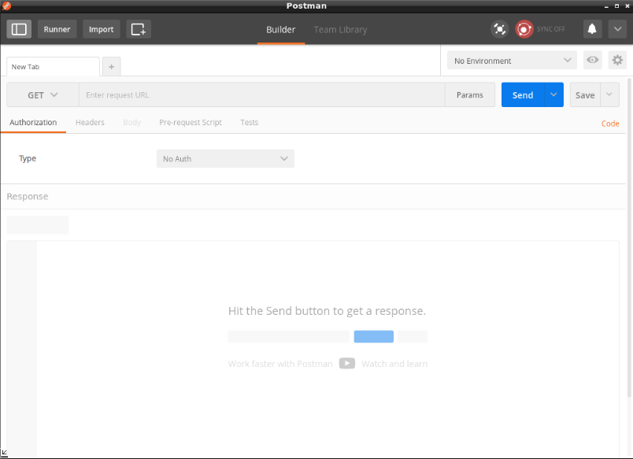
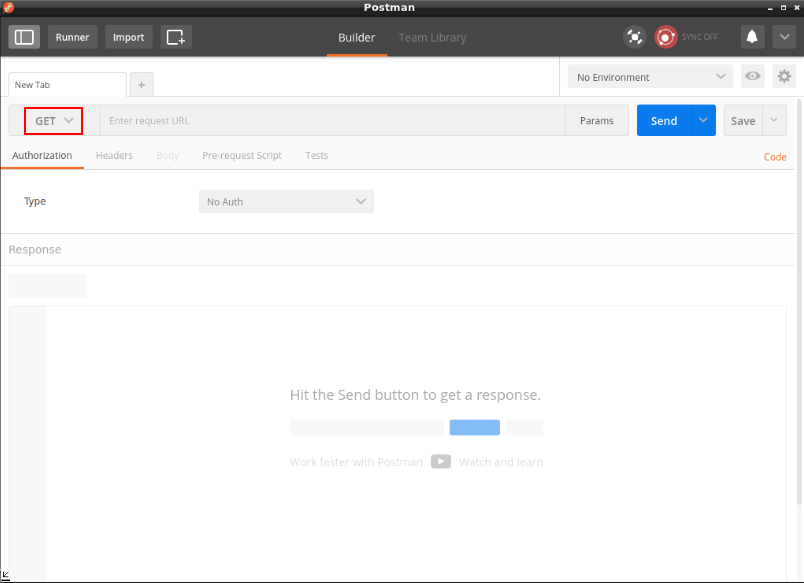
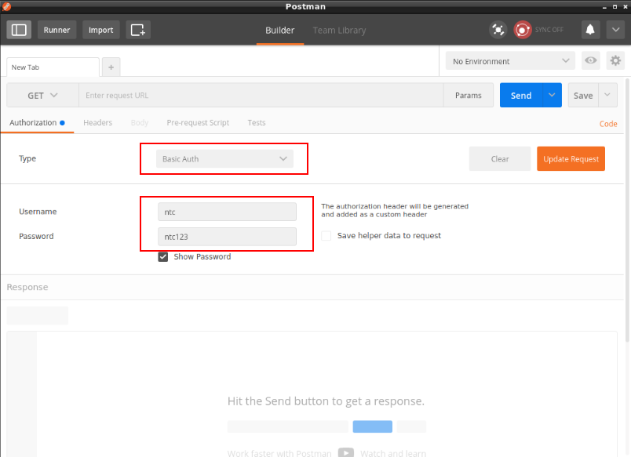
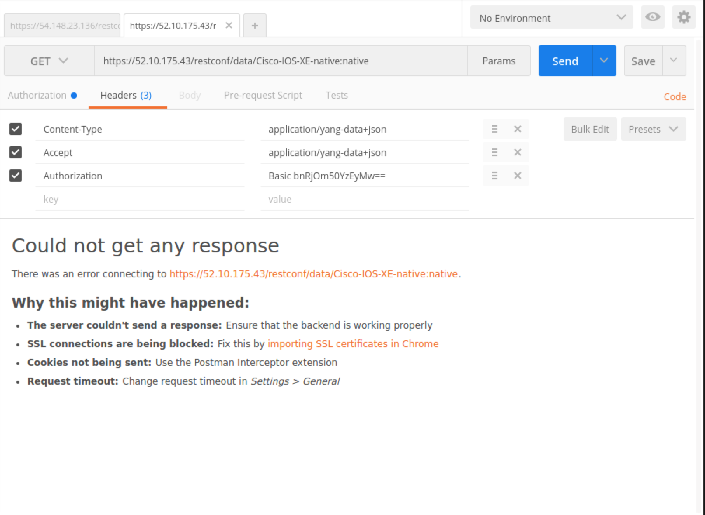
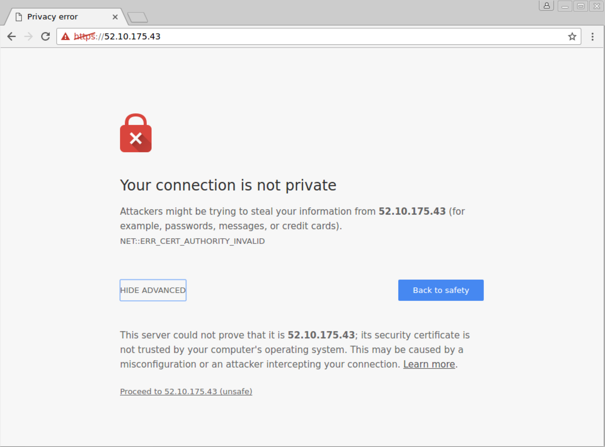

## Lab 23.1 - Exploring the IOS-XE RESTCONF API

### Task 1 - Browsing the IOS-XE Native Model with Postman

Cisco IOS-XE supports different YANG models and each these models use a different data structure.  This means you can "get" or "configure" particular features on XE with different JSON or XML objects.  

This task will focus on issuing GET requests with Postman.

Note: For these tasks, use the `csr1` device.

##### Step 1

Remote Desktop into your Jump Host and open the Postman application on the Desktop.



##### Step 2

We are now going to construct our first HTTP Request to get configuration data from the IOS-XE device.

First, set the HTTP request type to `GET`.



##### Step 3

In the Authorization tab, select `Basic Auth` for the **Type**, `ntc` for **Username** and `ntc123` for the **Password** respectively.



##### Step 4

In the Headers tab, add two header options:
  * `Accept`
  * `Content-Type` 

Set both to `application/yang-data+json`

> NOTE: The URL IP picture is incorrect.  

These headers are specific to RESTCONF. They mean we are going to be using JSON data, but it is JSON data that adheres to YANG models.



##### Step 5

Add the following URL next to the GET drop down:

```
https://csr1/restconf/data/Cisco-IOS-XE-native:native
```

This URL is a good starting point URL that returns a modeled running configuration using the Cisco "native" specific data model.

##### Step 6

Click the **Send** button to make the HTTP request.

##### Step 7

If it fails, open `https://YOUR_CSR1_IP`in the bottom pane.  You'll be prompted to accept the security risk of using a self-signed certificate.  
You'll be prompted to also login - you can click cancel.  There is no need to login.  Once you get prompted to login, you can move to the next step.



##### Step 8

Re-click the **Send** button.

##### Step 9

You should see a large JSON response in the bottom pane.

Scroll through the response object and take a deeper look.

Note that **Status** code is 200.  This is a standard HTTP Response code and tell us that everything worked.

This is a sample of what you'll see in Postman:

```json
{
    "Cisco-IOS-XE-native:native": {
        "version": "16.6",
        "boot-start-marker": [
            null
        ],
        "boot-end-marker": [
            null
        ],
        "service": {
            "timestamps": {
                "debug": {
                    "datetime": {
                        "msec": {}
                    }
                },
                "log": {
                    "datetime": {
                        "msec": [
                            null
                        ]
                    }
                }
            }
        }}}
# output truncated

```

##### Step 10

You can now limit the response and filter by adding "keys" found in the JSON response to the URL.

For example, `version` was a root key as we saw in the response above.  

##### Step 11

Add `version` to the URL.

This should be the updated URL:

```
https://csr1/restconf/data/Cisco-IOS-XE-native:native/version
```

##### Step 12

Click **Send**

You should see the following response:

```
{
    "Cisco-IOS-XE-native:version": "16.6"
}
```

Much different and cleaner response?

##### Step 13

Query for all interfaces using this URL:

```
https://csr1/restconf/data/Cisco-IOS-XE-native:native/interface
```

##### Step 14

Query for just GigabitEthernet2:

```
https://csr1/restconf/data/Cisco-IOS-XE-native:native/interface=GigabitEthernet/2
```

Response:

```
{
    "Cisco-IOS-XE-native:GigabitEthernet": {
        "name": "2",
        "description": "Connects to csr3",
        "ip": {
            "address": {
                "primary": {
                    "address": "10.1.13.1",
                    "mask": "255.255.255.0"
                }
            }
        },
        "mop": {
            "enabled": false
        },
        "Cisco-IOS-XE-ethernet:negotiation": {
            "auto": true
        }
    }
}
```


##### Step 15

Query for just the interface description:

```
https://csr1/restconf/data/Cisco-IOS-XE-native:native/interface=GigabitEthernet/2/description
```

Response:

```
{
    "Cisco-IOS-XE-native:description": "Connects to csr3"
}
```


##### Step 16

Query for just the Primary Address and Mask:

> You should have a configured IP on Gi2 from a previous lab.  If not, configure an address and mask on Gi2 first.

##### Step 17

```
https://csr1/restconf/data/Cisco-IOS-XE-native:native/interface=GigabitEthernet/2/ip/address/primary
```

```
{
    "Cisco-IOS-XE-native:primary": {
        "address": "10.1.13.1",
        "mask": "255.255.255.0"
    }
}
```

You can continue trying "different URLs" to query different sets of data.

##### Step 18

As we said earlier, IOS-XE supports different models of data.  Let's see what interface configuration data looks like modeled in a different fashion.  

Now query the device's GigabitEthernet2, but using the **IETF interfaces model**:

```
https://csr1/restconf/data/ietf-interfaces:interfaces/interface=GigabitEthernet2
```

Response:

```
{
    "ietf-interfaces:interface": {
        "name": "GigabitEthernet2",
        "description": "Connects to csr3",
        "type": "iana-if-type:ethernetCsmacd",
        "enabled": true,
        "ietf-ip:ipv4": {
            "address": [
                {
                    "ip": "10.1.13.1",
                    "netmask": "255.255.255.0"
                }
            ]
        },
        "ietf-ip:ipv6": {}
    }
}
```

Notice how this is the same exact data received in Step 14, but with just a different data structures? That's because it's validated using a different model!


##### Step 19

Limit the response to just the configured IP addresses:

```
https://csr1/restconf/data/ietf-interfaces:interfaces/interface=GigabitEthernet2/ietf-ip:ipv4/address/
```

```
{
    "ietf-ip:address": [
        {
            "ip": "10.1.13.1",
            "netmask": "255.255.255.0"
        }
    ]
}
```


##### Step 20

Let's look at one more data structure for an interface.  

This time using the **OpenConfig model** for interfaces:

```
https://csr1/restconf/data/openconfig-interfaces:interfaces/interface=GigabitEthernet2
```

Response:

```
{
    "openconfig-interfaces:interface": {
        "name": "GigabitEthernet2",
        "config": {
            "type": "iana-if-type:ethernetCsmacd",
            "name": "GigabitEthernet2",
            "description": "Connects to csr3",
            "enabled": true
        },
        "state": {
            "type": "iana-if-type:ethernetCsmacd",
            "name": "GigabitEthernet2",
            "description": "Connects to csr3",
            "enabled": true,
            "ifindex": 0,
            "admin-status": "UP",
            "oper-status": "UP",
            "last-change": "2018-02-22T07:57:28.0009+00:00",
            "counters": {
                "in-octets": 515836,
                "in-unicast-pkts": 1502,
                "in-broadcast-pkts": 0,
                "in-multicast-pkts": 0,
                "in-discards": 0,
                "in-errors": 0,
                "in-unknown-protos": 0,
                "out-octets": 516060,
                "out-unicast-pkts": 1501,
                "out-broadcast-pkts": 0,
                "out-multicast-pkts": 0,
                "out-discards": 0,
                "out-errors": 0,
                "last-clear": "2018-02-22T07:52:51.000993+00:00"
            }
        },
        "subinterfaces": {
            "subinterface": [
                {
                    "index": 0,
                    "config": {
                        "index": 0,
                        "name": "GigabitEthernet2",
                        "description": "Connects to csr3",
                        "enabled": true
                    },
                    "state": {
                        "index": 0,
                        "name": "GigabitEthernet2.0",
                        "description": "Connects to csr3",
                        "enabled": true,
                        "admin-status": "UP",
                        "oper-status": "UP",
                        "last-change": "2018-02-22T07:57:28.0009+00:00",
                        "counters": {
                            "in-octets": 515836,
                            "in-unicast-pkts": 1502,
                            "in-broadcast-pkts": 0,
                            "in-multicast-pkts": 0,
                            "in-discards": 0,
                            "in-errors": 0,
                            "out-octets": 516060,
                            "out-unicast-pkts": 1501,
                            "out-broadcast-pkts": 0,
                            "out-multicast-pkts": 0,
                            "out-discards": 0,
                            "out-errors": 0,
                            "last-clear": "2018-02-22T07:52:51.000993+00:00"
                        }
                    },
                    "openconfig-if-ip:ipv4": {
                        "addresses": {
                            "address": [
                                {
                                    "ip": "10.1.13.1",
                                    "config": {
                                        "ip": "10.1.13.1",
                                        "prefix-length": 24
                                    },
                                    "state": {
                                        "ip": "10.1.13.1",
                                        "prefix-length": 24
                                    }
                                }
                            ]
                        }
                    },
                    "openconfig-if-ip:ipv6": {
                        "config": {
                            "enabled": false
                        },
                        "state": {
                            "enabled": false
                        }
                    }
                }
            ]
        },
        "openconfig-if-ethernet:ethernet": {
            "config": {
                "auto-negotiate": true
            }
        }
    }
}
```


### Task 2: Making Configuration Changes using the Native Model

In this task we want to manage the configuration of a loopback interface.  When you start doing configuration via a RESTful API, it's usually easier to configure something manually via SSH, do a HTTP GET via Postman, and then push that object back via a PATCH/POST/PUT to ensure it's structured properly.  

That's the methodology we'll use here.


##### Step 1

SSH to **csr1** and add a Loopback200 with the following commands:

```
config t
interface loopback200
  ip address 10.200.200.1 255.255.255.0
end
```

Verify it's configured properly.

```
csr1#show run interface loopback 200
Building configuration...

Current configuration : 117 bytes
!
interface Loopback200
 ip address 10.200.200.1 255.255.255.0
end

csr1#
```

##### Step 2

Update the URL in Postman to query the configuration for Loopback200:

```
https://csr1/restconf/data/Cisco-IOS-XE-native:native/interface=Loopback/200/ip/address
```

You should see this response:

```
{
    "Cisco-IOS-XE-native:address": {
        "primary": {
            "address": "10.200.200.1",
            "mask": "255.255.255.0"
        }
    }
}
```


##### Step 3

Change the HTTP Verb to **PATCH**.  

As soon as you change the verb to **PATCH**, a new tab will be available where you put the "data" we can send to the device.  This will be the "Body" tab next to the "Authorization" and "Headers" tabs.

Simply copy the response from Step 2 into to the "Body" tab (using the **raw** sub-bullet, which should be the default).

##### Step 4

Click Send making a **PATCH** to device.

You should see a **204 No Content**

This means it was successful.

##### Step 5

SSH back to the device.

Verify there has been no change in configuration.

```
csr1#show run interface loopback 200
Building configuration...

Current configuration : 117 bytes
!
interface Loopback200
 ip address 10.200.200.1 255.255.255.0
end

csr1#
```

##### Step 6

Add several secondary interfaces to this interface so the updated configuration looks like this:


```
csr1#show run interface loopback 200
Building configuration...

Current configuration : 117 bytes
!
interface Loopback200
 ip address 10.202.202.1 255.255.255.0 secondary
 ip address 10.202.203.1 255.255.255.0 secondary
 ip address 10.202.204.1 255.255.255.0 secondary
 ip address 10.200.200.1 255.255.255.0
end

csr1#
```

##### Step 7

Re-issue the **PATCH**.

You should still see **204 No content**.

Even though you only have the primary interface in the "Body" there is no change.  Remember, a **PATCH** is simply a "merge" operation and it's just ensuring that interface is there -- not affecting any of the secondary interfaces.

##### Step 8

Change the HTTP verb to **GET** and click **Send**.

You should see the updated interfaces in the JSON response:

```
{
    "Cisco-IOS-XE-native:address": {
        "primary": {
            "address": "10.200.200.1",
            "mask": "255.255.255.0"
        },
        "secondary": [
            {
                "address": "10.202.202.1",
                "mask": "255.255.255.0",
                "secondary": [
                    null
                ]
            },
            {
                "address": "10.202.203.1",
                "mask": "255.255.255.0",
                "secondary": [
                    null
                ]
            },
            {
                "address": "10.202.204.1",
                "mask": "255.255.255.0",
                "secondary": [
                    null
                ]
            }
        ]
    }
}
```

##### Step 9

Change to the verb to be a HTTP **PUT**. Verify the "Body" still has the following object:

##### Step 10

```
{
    "Cisco-IOS-XE-native:address": {
        "primary": {
            "address": "10.200.200.1",
            "mask": "255.255.255.0"
        }
    }
}
```

##### Step 11

Click **Send**.

##### Step 12

SSH back into **csr1** and verify the new configuration:

```
csr1#show run interface loopback 200
Building configuration...

Current configuration : 68 bytes
!
interface Loopback200
 ip address 10.200.200.1 255.255.255.0
end

csr1#
```

Keep in mind a **PUT** ensure whatever you're pushing to the device is the ONLY configuration for that object.  In this case, the object is Loopback200.  It has great power with ensuring the configuration you're pushing to the device is the only configuration on the device (but could also cause damage if not used properly).


